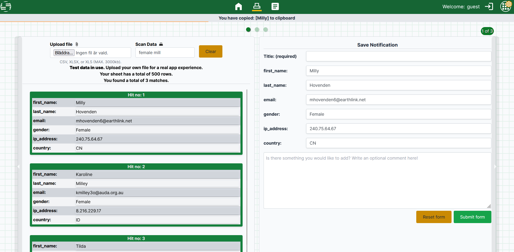
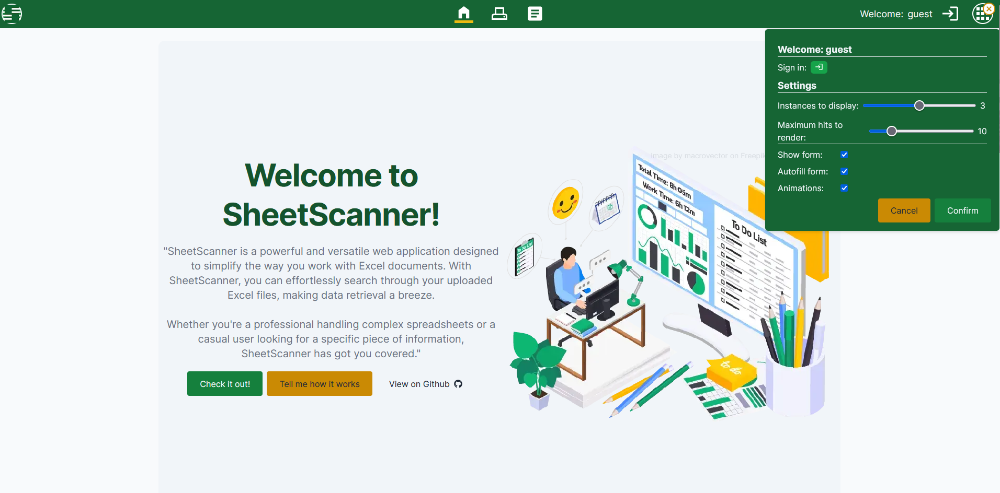

## SheetScanner - Scan your spread sheets with ease!

SheetScanner is my exam project at Medieinstitutet FED22. It's a powerful and versatile web application designed to simplify the way you work with Excel documents. With SheetScanner, you can effortlessly search through your uploaded Excel files, making data retrieval a breeze with advanced search functionallity and note creation.

## Codestack :
     

## Setup 

Before you start, ensure you have the following installed:

Node.js 
npm/yarn
Firebase account (for authentication) 
MongoDB account (for database connection)

### Getting Started 

Clone the repository:

1. Get the files: run "git clone https://github.com/existenztim/SheetScanner.git" 
2. Get dependencies: run "npm i".
3. Get authentication: Create a firebase account and obtain the google configuration details.
4. Get db connection: Create an account at https://www.mongodb.com and create a new cluster, obtain the details. If you intend to use a local db, use MongoDB compass.
5. Setup .env variables: Create a .env file in the root of the project with the following variables below:

- MONGODB_URI = "mongodb+srv://[your name]:[your cluster name].mongodb.net/[your db name here]"
- MONGODB_URI_LOCAL = "mongodb://localhost:27017/sheetscanner" (or your preferred port)
- FIREBASE_API_KEY='[your api key]'
- FIREBASE_AUTH_DOMAIN='[your auth domain]'
- FIREBASE_PROJECT_ID='[your project id]'
- FIREBASE_STORAGE_BUCKET='[your storage bucket]'
- FIREBASE_MESSAGING_SENDER_ID='[your messaging sender id]'
- FIREBASE_APP_ID='[your app id]'
- LOCAL_BASE_ROUTE='http://localhost:3000/api' (or your preferred port)
- CLOUD_BASE_ROUTE='https://sheet-scanner.vercel.app/api' (or your preferred host)
- USER_ROUTE='/[your preferred user route]' (has to match the structure inside the api folder, by default it's '/user')
- NOTE_ROUTE='/[your preferred note route]' (has to match the structure inside the api folder, by default it's '/notes')

6. Get the project up and running locally: run "npm run dev".

## Scripts

- npm run dev: Start the development server. 
- npm run build: Build the production-ready application. 
- npm start: Start the production server. 
- npm run lint: Run linting using Next.js lint. 
- npm test: Run Jest tests. 
- npm run test:watch: Run Jest tests in watch mode.

## Lighthouse repport

## Images

## Authors

- [@existenztim](https://github.com/existenztim)

